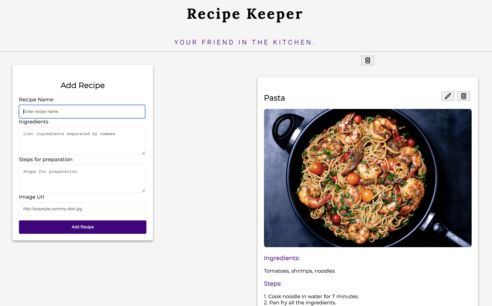
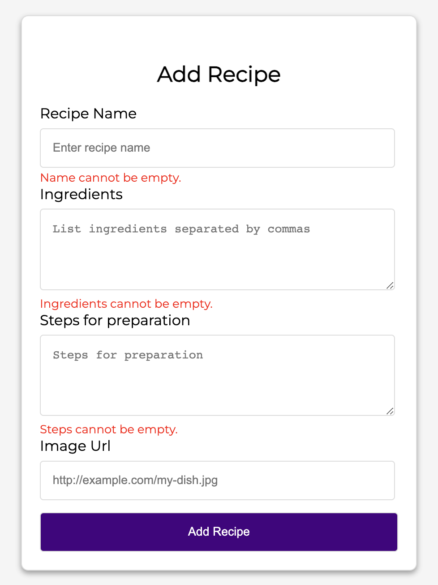
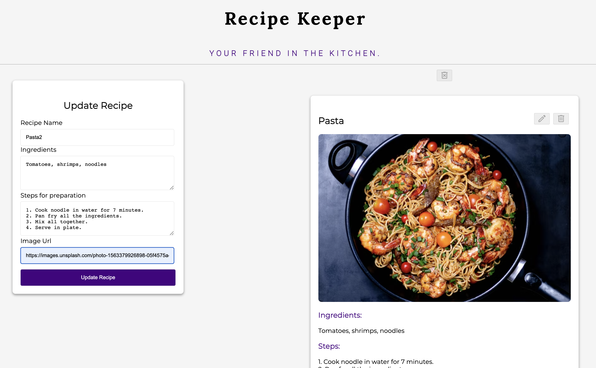
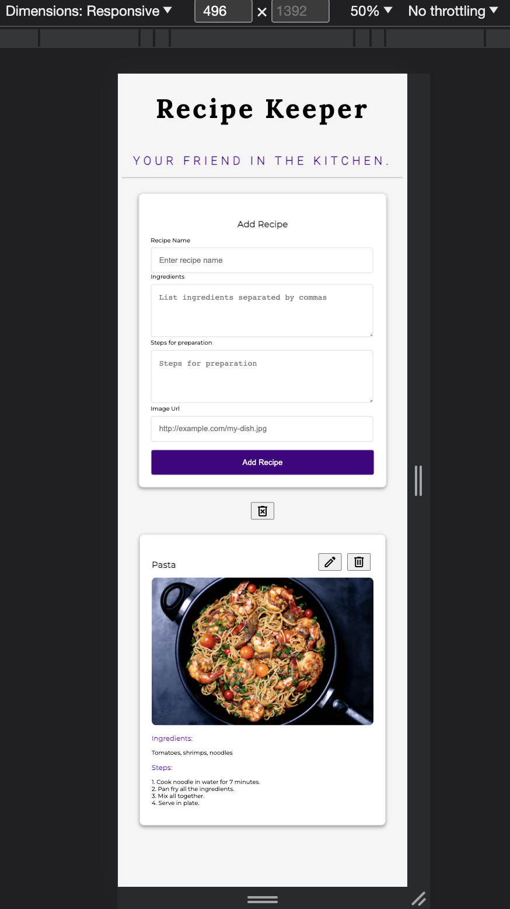
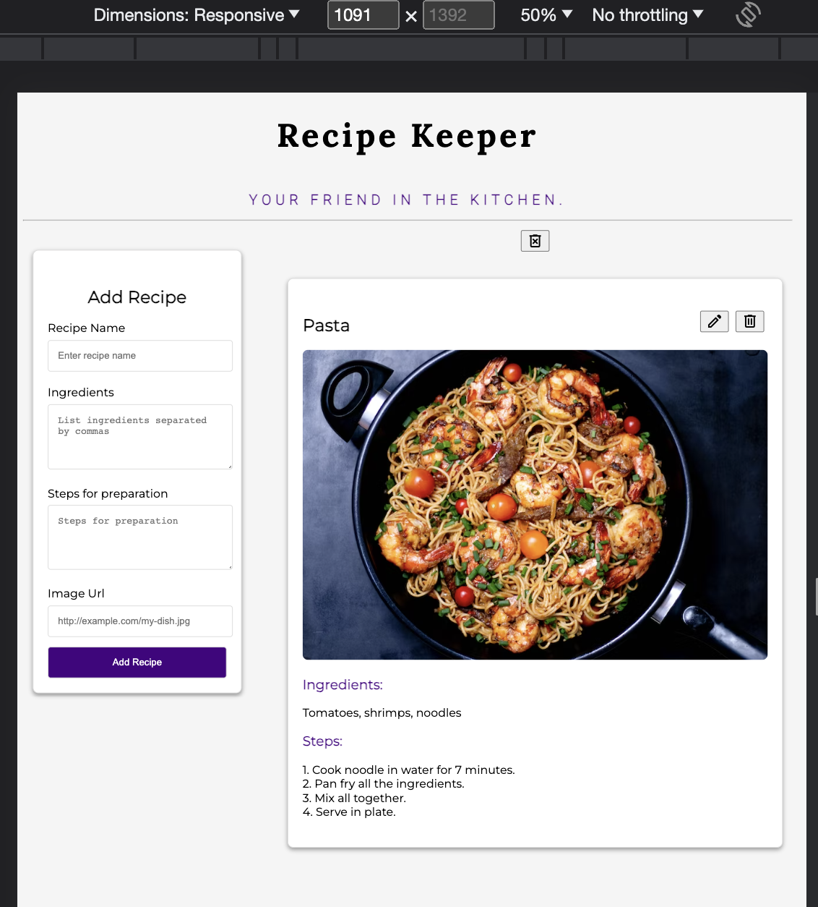

# recipeKeeper
A responsive front-end web application using HTML, JavaScript, and CSS. 
Managing (Add, Edit, Delete) recipes using localStorage and Document Object Model (DOM).
Improve user experience by utilizing Google Fonts, Icons, and Media Query.

# 

# 

# 

# 

# 
